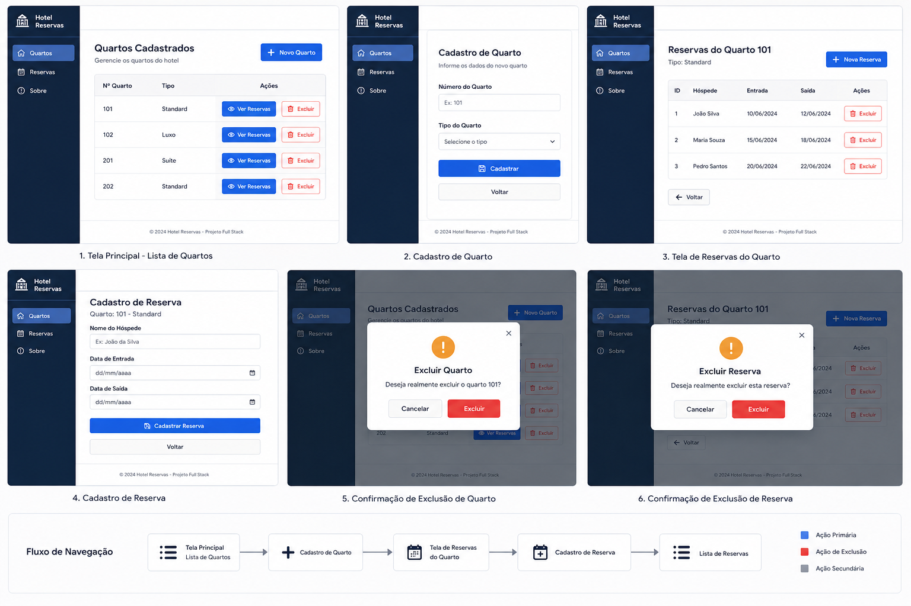
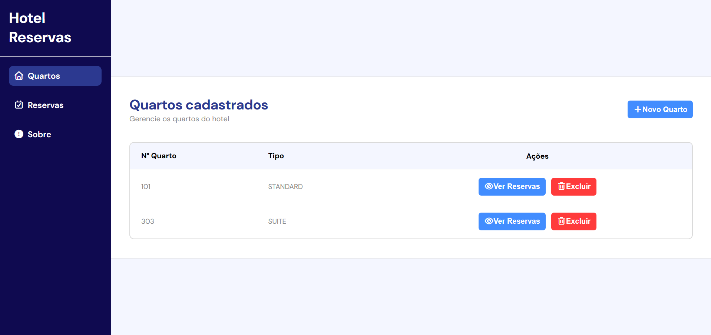
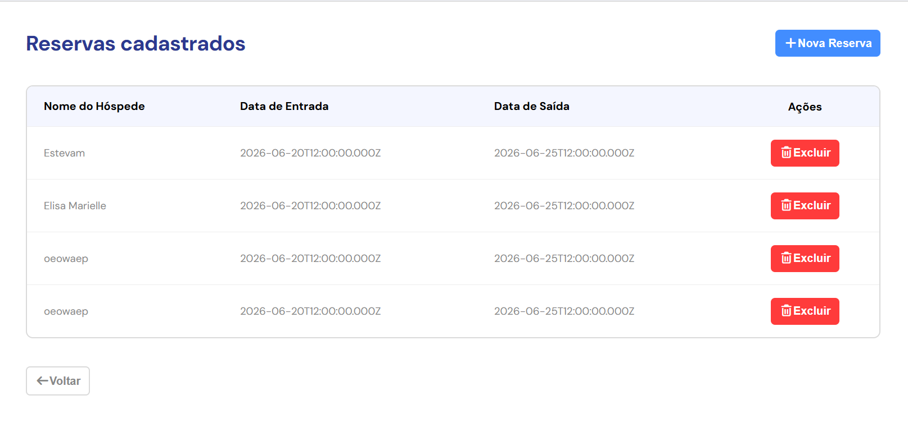
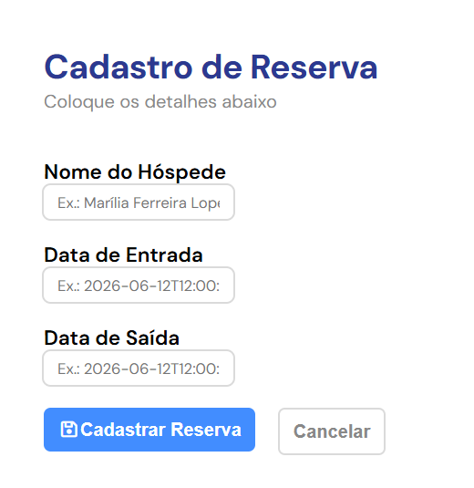

# Hotel Reservas

## Tecnologias

- Node.js
- Express
- Cors
- JavaScript
- Prisma
- MySQL
- HTML
- CSS
- VSCode

## Como executar

### Banco

1. Criar banco hotel_db
2. Executar banco.sql

### API
cd api
npm install
npx prisma generate
npm run dev

### Front-end
cd web
npm install
npm run dev

## Funcionalidades
- Cadastro de quartos
- Listagem de quartos
- Exclusão de quartos
- Cadastro de reservas
- Listagem de reservas
- Exclusão de reservas

## Prints
- **Exemplo:**

- **Site:**
| Home | Cadastro de quartos | Reservas | Cadastro de reservas |
| :---: | :---: | :---: | :---: |
|  |  |  |  |

